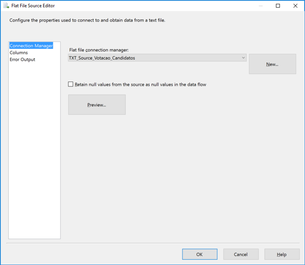
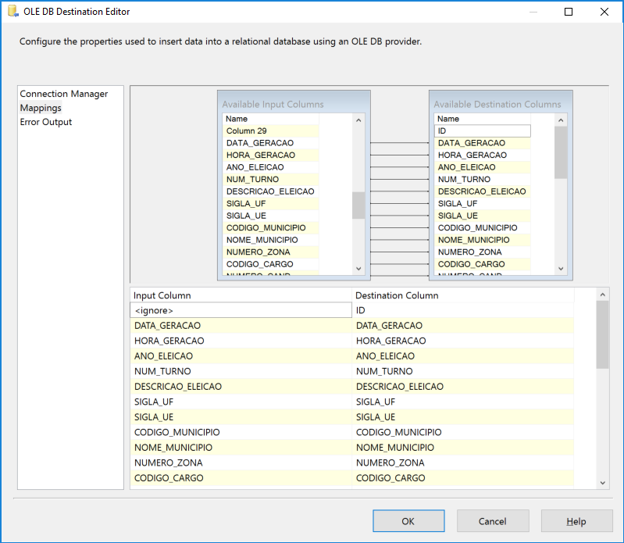

# ETL - Extração, Transformação e Carga de Dados #

Como já sabemos os dados utilizados neste projeto vem do [Repositório de Dados Eleitorais - TSE - Tribunal Superior Eleitoral](http://www.tse.jus.br/hotSites/pesquisas-eleitorais/index.html) em formato ".txt", com a intensão de fornecer maior confiabilidade no armanezamento destes dados, criamos alguns STAGE's que foram povoadas utilizando o processo que damos o nome de ETL (Extração, Transformação e Carga de Dados), para executar tais tarefas que serão detalhadas abaixo, utilizamos a ferramenta da Microsoft denominada <strong>SSIS - SQL Server Integration Server</strong>.

### Extração ###

 Na tarefa de Extração dos dados precisamos criar uma conexão com os arquivos em formato ".txt" que iriamos utilizar, respeitando assim seu delimitador e qualificador (Estas informações foram cedidas no arquivo LEIAME.pdf anexo aos demais arquivos).

### Transformação ###

 Para todas as STAGE's fez-se necessário fazer uma conversão de datatype <strong>"String -> DBDATE"</strong>, <strong>"String -> TIMESTAMP"</strong>, <strong>"String -> Int"</strong>, deixando assim os dados compatíveis a estrutura da tabela de destino em cada um dos bancos STAGE's criado.

### Carga de Dados ###

 Tendo sido completada as tarefas de Extração e Transformação, a carga dos dados foi simples, sendo necessário apenas um mapeamento de qual coluna do arquivo iria para qual coluna da tabela e pronto, nosso ETL está finalizado.

